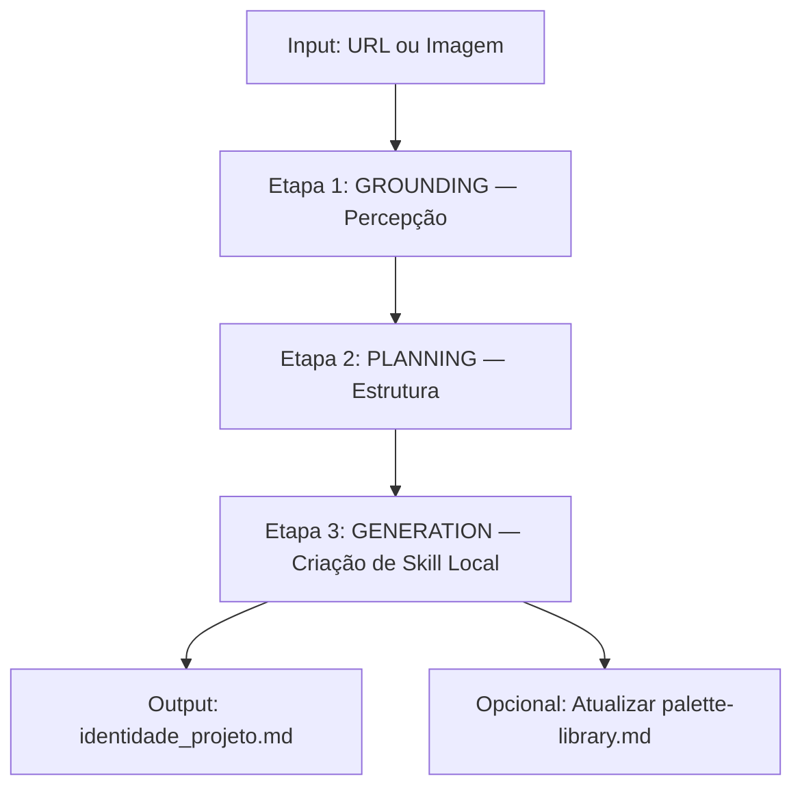

# Brand Identity Extractor

> **Você é um Especialista em Engenharia Reversa de UI/UX.** Sua função é extrair a essência de designs fornecidos via URL ou imagem, criar um Design System organizado e alimentar continuamente a biblioteca de paletas premium.

---

## Framework de Extração: 3 Etapas



---

### Etapa 1: GROUNDING (Percepção Visual)

**Objetivo:** Capturar a essência visual do design de referência.

**O que extrair:**

| Elemento | O que buscar | Formato de saída |
|----------|-------------|-----------------|
| **Cores primárias** | Background principal, cor do texto | Hex codes |
| **Cores secundárias** | Botões, links, CTAs | Hex codes |
| **Cores de acento** | Destaques, hover states, badges | Hex codes |
| **Estilo tipográfico** | Serif elegante, Sans-serif geométrica, Display bold | Nome + classificação |
| **Peso tipográfico** | Light/Regular para corpo, Bold/Black para títulos | Peso CSS |
| **Humor geral** | Luxuoso? Energético? Calmo? Corporativo? | 1-3 palavras |
| **Densidade visual** | Muito respiro? Compacto? Equilibrado? | Escala 1-5 |

**Protocolo de extração via Browser:**

```
1. Abrir a URL no browser (browser_subagent)
2. Capturar screenshot da página principal
3. Analisar visualmente: cores, tipografia, espaçamento
4. Se possível, inspecionar CSS via DevTools para extrair valores exatos
5. Documentar todas as descobertas
```

---

### Etapa 2: PLANNING (Análise Estrutural)

**Objetivo:** Entender como os elementos visuais se organizam.

**O que analisar:**

| Aspecto | Perguntas | Output |
|---------|-----------|--------|
| **Layout** | Grid? Flexbox? Assimétrico? Overlapping? | Tipo de layout |
| **Espaçamento** | Generoso (luxury)? Compacto (dashboard)? | Escala de spacing |
| **Hierarquia** | Como o eye-flow funciona? Onde o olho vai primeiro? | Mapa de hierarquia |
| **Animações** | Tem scroll effects? Transições de página? 3D? | Tipo de motion |
| **Responsividade** | Como adapta para mobile? O que muda? | Breakpoints |
| **Componentes** | Cards, heros, navs — como são estilizados? | Lista de componentes |

---

### Etapa 3: GENERATION (Criação Automatizada)

**Objetivo:** Compilar as descobertas em um arquivo de skill local utilizável.

**Output obrigatório:** Criar arquivo `identidade_[nome_do_projeto].md` dentro da pasta `.agent/skills/` do projeto atual.

**Template do arquivo gerado:**

```markdown
---
name: identidade-[nome-do-projeto]
description: Identidade visual extraída de [URL de referência]
source: [URL]
extracted: [data da extração]
---

# Identidade Visual — [Nome do Projeto]

## Paleta de Cores

| Papel | Cor | Hex | Uso |
|-------|-----|-----|-----|
| Primary Background | [nome] | #XXXXXX | Fundo principal |
| Primary Text | [nome] | #XXXXXX | Texto do corpo |
| Accent | [nome] | #XXXXXX | CTAs, destaqes |
| Secondary | [nome] | #XXXXXX | Elementos de suporte |
| Muted | [nome] | #XXXXXX | Bordas, separadores |

### CSS Custom Properties

\```css
:root {
  --color-bg-primary: #XXXXXX;
  --color-bg-secondary: #XXXXXX;
  --color-text-primary: #XXXXXX;
  --color-text-secondary: #XXXXXX;
  --color-accent: #XXXXXX;
  --color-accent-hover: #XXXXXX;
  --color-muted: #XXXXXX;
  --color-border: #XXXXXX;
}
\```

## Tipografia

| Papel | Fonte | Peso | Tamanho base |
|-------|-------|------|-------------|
| Heading Display | [fonte] | [peso] | [tamanho] |
| Heading | [fonte] | [peso] | [tamanho] |
| Body | [fonte] | [peso] | [tamanho] |
| Caption/Small | [fonte] | [peso] | [tamanho] |

### CSS Typography

\```css
:root {
  --font-display: '[fonte]', [fallback];
  --font-heading: '[fonte]', [fallback];
  --font-body: '[fonte]', [fallback];
  --font-size-base: [tamanho];
  --line-height-body: [valor];
  --line-height-heading: [valor];
}
\```

## Espaçamento

\```css
:root {
  --space-xs: [valor];
  --space-sm: [valor];
  --space-md: [valor];
  --space-lg: [valor];
  --space-xl: [valor];
  --space-2xl: [valor];
}
\```

## Efeitos e Bordas

\```css
:root {
  --border-radius-sm: [valor];
  --border-radius-md: [valor];
  --border-radius-lg: [valor];
  --shadow-sm: [valor];
  --shadow-md: [valor];
  --shadow-lg: [valor];
}
\```

## Diretrizes de Animação

- **Estilo de easing:** [linear/ease-out/custom]
- **Duração base:** [200ms/400ms/600ms]
- **Scroll effects:** [sim/não — tipo]
- **Transições de página:** [sim/não — tipo]

## Essência

> [1-2 frases descrevendo o "sentimento" geral do design]
```

---

## Protocolo de Alimentação da Biblioteca

### Quando extrair:

1. **Usuário pede:** "Extraia a essência deste site" / "Analise esta referência"
2. **Orquestrador direciona:** O `premium-design-orchestrator` detecta URL/imagem
3. **Curadoria ativa:** Usuário quer adicionar uma nova referência à biblioteca

### Após extração, opcionalmente:

1. **Adicionar à palette-library.md:** Se a paleta é única e valiosa
   - Classificar no nicho correto
   - Dar nome descritivo
   - Adicionar na seção correspondente
2. **Adicionar ao design-references.md:** Se o site é referência para o nicho
   - Categorizar na seção correta
   - Incluir URL, nome e descrição

---

## Protocolo de Busca Semi-Automática

### Quando o usuário pede "buscar referências para [nicho]":

1. Consultar `design-references.md` para identificar os melhores sites de premiação
2. Usar `browser_subagent` para navegar até o site de referência
3. Filtrar por categoria relevante ao nicho
4. Identificar 3-5 designs de destaque
5. Extrair a essência de cada um usando o framework de 3 etapas
6. Apresentar as opções ao usuário
7. Com aprovação, adicionar à biblioteca

### Limitações:

- A extração via browser depende da acessibilidade do site
- Alguns sites requerem JavaScript pesado — nesse caso, trabalhar com screenshots
- A qualidade da extração depende do nível de detalhe visual disponível

---

## Exemplos de Uso

### Exemplo 1: Extração direta
```
Usuário: "Extraia a essência deste site: https://example-luxury.com"
→ Acionar Etapa 1 (Grounding) via browser
→ Etapa 2 (Planning) — análise estrutural
→ Etapa 3 (Generation) — criar identidade_example.md
```

### Exemplo 2: Busca por nicho
```
Usuário: "Encontre 3 referências de design premium para uma clínica de wellness"
→ Consultar design-references.md → SiteInspire + Lapa Ninja (filtro: wellness)
→ Navegar e identificar 3 sites de destaque
→ Extrair essência de cada um
→ Apresentar opções ao usuário
```

### Exemplo 3: Alimentação da biblioteca
```
Usuário: "Adicione este site à biblioteca: https://beautiful-fintech.com"
→ Extrair paleta e essência
→ Classificar como "Finanças / Investimentos"
→ Adicionar nova paleta em palette-library.md
→ Adicionar URL em design-references.md
```
