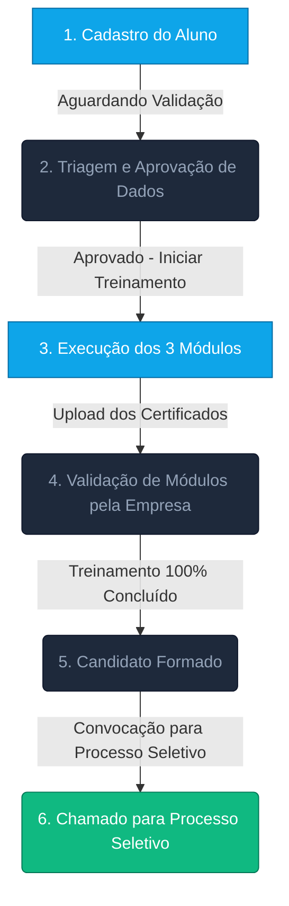

# 🚀 Apresentação de Funcionalidades — Escolas Parceiras
### Plataforma Escola Recomendada | Central de Gestão e Treinamento de Candidatos

Bem-vindo(a) à plataforma **Escola Recomendada**. Este documento foi elaborado para apresentar detalhadamente todas as funcionalidades operacionais disponíveis para as escolas parceiras integradas ao ecossistema de formação e seleção de candidatos da nossa Empresa.

A plataforma automatiza e descomplica a comunicação de novos alunos, o registro de progresso nos treinamentos e o envio de certificações, eliminando a dependência de planilhas manuais e e-mails corporativos.

---

## 💡 Proposta de Valor para a Escola Parceira

A plataforma centraliza a gestão dos seus alunos indicados e simplifica a comunicação com a Empresa administradora. Com o uso do sistema, a sua escola ganha:

*   **Visibilidade Completa**: Acompanhamento em tempo real do status de cada aluno, desde o cadastro até a contratação.
*   **Processo de Auditoria Digital**: Envio simplificado de certificados digitais diretamente pelas telas do sistema.
*   **Agilidade nas Respostas**: Feedback imediato das validações de documentos através da central de notificações.
*   **Controle Histórico**: Acesso rápido a todos os alunos que já se formaram e participaram de processos seletivos.

---

## 🔄 Fluxo e Ciclo de Vida do Candidato (Visão Escola)

O ciclo de vida do aluno dentro do sistema é dividido em três fases principais de responsabilidade compartilhada:



### 1. Fase de Validação Cadastral (Início)
*   **Ação da Escola**: Cadastra o candidato no sistema inserindo três dados obrigatórios: Registro do Empregado (RE), Nome Completo e Licença ANAC.
*   **Status do Aluno**: `Aguardando Validação`. Neste momento, os administradores da Empresa revisam as informações fornecidas.

### 2. Fase de Treinamento e Progresso (Operação Escola)
*   **Ação da Escola**: Após a validação cadastral da Empresa, o aluno entra em treinamento. A escola gerencia o progresso dos **3 Módulos Obrigatórios**:
    *   📚 **Módulo Teórico**
    *   🎮 **Módulo de Simulador**
    *   ✈️ **Módulo de Voo**
*   **Ação da Escola**: Conforme o aluno conclui as etapas, a escola realiza o upload do certificado digital de conclusão com a respectiva data.

### 3. Fase de Conclusão e Seleção (Resultado)
*   **Ação da Escola**: O sistema valida automaticamente quando os 3 módulos são aprovados pela Empresa. O candidato é graduado para o status `Concluído`.
*   **Status de Processo Seletivo**: A escola acompanha se o aluno já foi chamado pela Empresa administradora para a etapa final de contratação.

---

## 🖥️ Funcionalidades Principais do Painel da Escola

O Painel da Escola foi desenhado de forma enxuta para que as instituições parceiras possam focar estritamente na produtividade operacional. Abaixo estão descritas as funcionalidades da tela principal:

```
+---------------------------------------------------------------------------------------------------------+
| [Logotipo]  | Dashboard   Nossos Candidatos   Solicitar Validação                    [Sino (1)] [Escola A] |
+---------------------------------------------------------------------------------------------------------+
|                                                                                                         |
|  PAINEL DA ESCOLA (Escola Alfa)                      [ + Novo Candidato ]                               |
|                                                                                                         |
|  +--------------------+  +--------------------+  +--------------------+  +--------------------+         |
|  | MEUS ALUNOS ATIVOS |  | AGUARDANDO VALIDAÇ.|  | CURSOS CONCLUÍDOS  |  | CHAMADOS P. S.     |         |
|  |        18          |  |        4           |  |        42          |  |        10          |         |
|  | [Em treinamento]   |  | [Pelo Admin Empresa] | [Total histórico]  |  | [Pelo Admin]       |         |
|  +--------------------+  +--------------------+  +--------------------+  +--------------------+         |
|                                                                                                         |
|  ACOMPANHAMENTO DE CANDIDATOS EM TREINAMENTO                                                            |
|  +---------------------------------------------------------------------------------------------------+  |
|  | Candidato    | RE      | ANAC    | Progresso Módulos             | Última Alteração | Ações           |  |
|  +--------------+---------+---------+-------------------------------+------------------+-----------------+  |
|  | Lucas Lima   | RE-3412 | AC-8910 | [Teórico: OK] [Sim: OK] [Voo:-] 14/07/2026     | [ Anexar Voo ]  |  |
|  | Bruno Souza  | RE-7721 | AC-5542 | [Teórico: OK] [Sim:-]   [Voo:-] 12/07/2026     | [ Anexar Sim ]  |  |
|  +---------------------------------------------------------------------------------------------------+  |
|                                                                                                         |
+---------------------------------------------------------------------------------------------------------+
```

### 1. Indicadores Rápidos (Cards de Topo)
*   **Meus Alunos Ativos**: Quantidade de alunos em fase ativa de treinamento.
*   **Aguardando Validação**: Candidatos cadastrados que dependem da triagem inicial da Empresa.
*   **Cursos Concluídos**: Total histórico de alunos da sua escola que finalizaram os 3 módulos do curso.
*   **Chamados P.S.**: Quantidade de alunos formados que foram convocados para o processo seletivo da Empresa.

### 2. Cadastro e Solicitação de Validação
*   Interface simplificada para envio de novos candidatos.
*   Validação em tempo real de formato de campos para evitar o envio de dados incorretos ou duplicados (ex: RE ou ANAC já cadastrados).

### 3. Painel de Controle de Treinamento (Lista Ativa)
*   Filtro e campo de busca para encontrar alunos rapidamente por Nome, RE ou ANAC.
*   **Barra de Progresso Visual**: Exibe graficamente o percentual de conclusão do curso (0%, 33%, 66% ou 100%).
*   **Visualização de Módulos por Cores**:
    *   ⚪ **Não Iniciado (Cinza)**: Módulo pendente de realização.
    *   🟡 **Aguardando Validação (Amarelo)**: Certificado enviado pela escola, pendente de aprovação pela Empresa.
    *   🟢 **Concluído e Validado (Verde)**: Certificado aprovado com sucesso (exibe a data de conclusão e a escola executora).

### 4. Gestão e Upload de Certificados
*   Formulário dedicado para anexar arquivos (PDF ou imagem) comprovando a finalização de cada módulo.
*   Registro da data exata de conclusão do treinamento.
*   Visualização rápida do histórico de uploads e arquivos anexados.

### 5. Central de Notificações em Tempo Real
*   **Sino de Alertas**: Exibe avisos imediatos quando a Empresa:
    *   Aprova ou recusa um novo candidato enviado.
    *   Valida ou recusa o certificado de um módulo específico (Teórico, Simulador ou Voo).
    *   Convoca o candidato concluído para o processo seletivo final.

---

> [!TIP]
> O uso correto da plataforma acelera o tempo médio de inserção de candidatos na Empresa. Garanta que os dados cadastrados estejam em conformidade com as fichas físicas dos alunos para evitar recusas na triagem.
