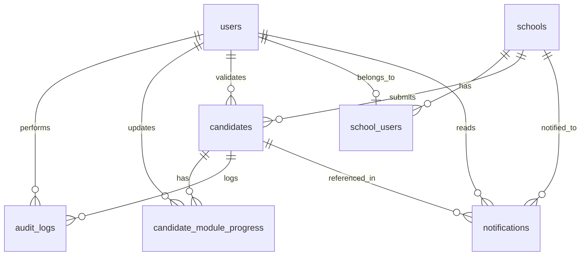
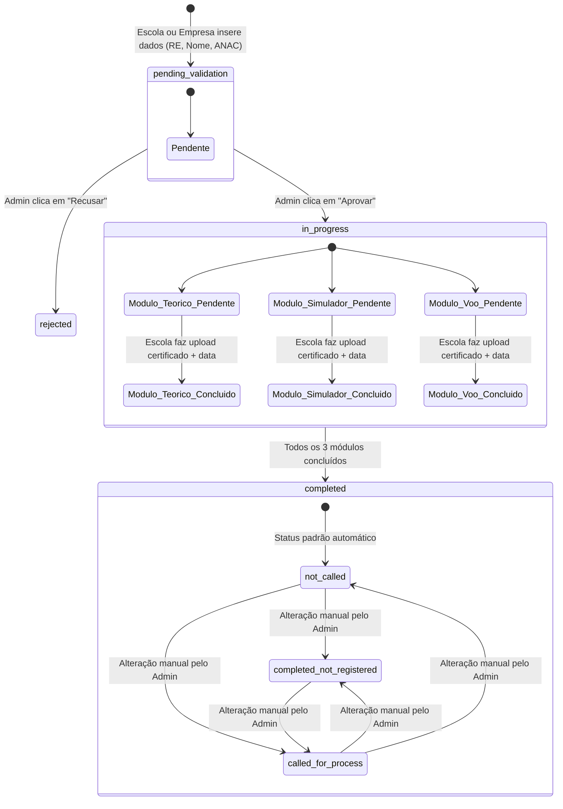

# Arquitetura do Sistema: Gestão de Treinamentos e Validação

Este documento apresenta a especificação técnica completa, abrangendo a modelagem de dados, lógica de estados, design de interfaces de dashboard, fluxo de notificações em tempo real e arquitetura de tecnologia para o sistema de gestão de candidatos.

---

## 1. Modelagem do Banco de Dados

Recomenda-se o uso de um banco de dados relacional (como **PostgreSQL**), devido à necessidade de transações ACID robustas, integridade referencial forte para a validação de candidatos, e suporte avançado para logs e auditoria.

### Diagrama Entidade-Relacionamento (ERD)



### Dicionário de Dados (Tabelas)

#### Tabela: `users`
Armazena as credenciais e perfis de acesso dos usuários do sistema.

| Campo | Tipo | Restrições | Descrição |
| :--- | :--- | :--- | :--- |
| `id` | UUID | PK, Default `uuid_generate_v4()` | Identificador único do usuário. |
| `email` | VARCHAR(255) | UNIQUE, NOT NULL | E-mail corporativo (utilizado para login). |
| `password_hash` | VARCHAR(255) | NOT NULL | Senha criptografada (ex: bcrypt/argon2). |
| `name` | VARCHAR(150) | NOT NULL | Nome completo do usuário. |
| `role` | VARCHAR(50) | NOT NULL | Perfil: `'admin'` (Minha Empresa) ou `'school_admin'` (Escola). |
| `created_at` | TIMESTAMP | DEFAULT NOW() | Data e hora de criação da conta. |
| `updated_at` | TIMESTAMP | DEFAULT NOW() | Data e hora da última atualização do registro. |

#### Tabela: `schools`
Registra as Escolas Recomendadas (parceiras) autorizadas a cadastrar e treinar candidatos.

| Campo | Tipo | Restrições | Descrição |
| :--- | :--- | :--- | :--- |
| `id` | UUID | PK, Default `uuid_generate_v4()` | Identificador único da escola. |
| `name` | VARCHAR(150) | NOT NULL | Nome da Escola Recomendada. |
| `cnpj` | VARCHAR(14) | UNIQUE, NOT NULL | CNPJ da instituição parceira (apenas números). |
| `active` | BOOLEAN | DEFAULT TRUE | Define se a escola está ativa no sistema. |
| `created_at` | TIMESTAMP | DEFAULT NOW() | Data de cadastro da escola parceira. |
| `updated_at` | TIMESTAMP | DEFAULT NOW() | Última alteração cadastral da escola. |

#### Tabela: `school_users`
Tabela associativa para vincular usuários do tipo `school_admin` às suas respectivas escolas.

| Campo | Tipo | Restrições | Descrição |
| :--- | :--- | :--- | :--- |
| `id` | UUID | PK, Default `uuid_generate_v4()` | Identificador único do vínculo. |
| `user_id` | UUID | FK -> `users(id)`, UNIQUE | Referência ao usuário. |
| `school_id` | UUID | FK -> `schools(id)` | Referência à escola. |
| `created_at` | TIMESTAMP | DEFAULT NOW() | Data do vínculo. |

#### Tabela: `candidates`
Entidade central do sistema. Armazena os dados do candidato e seus status de fluxo e seleção.

| Campo | Tipo | Restrições | Descrição |
| :--- | :--- | :--- | :--- |
| `id` | UUID | PK, Default `uuid_generate_v4()` | Identificador único do candidato. |
| `re` | VARCHAR(50) | UNIQUE, NOT NULL | Registro de Empregado. |
| `name` | VARCHAR(150) | NOT NULL | Nome completo do candidato. |
| `anac` | VARCHAR(50) | UNIQUE, NOT NULL | Número da licença ANAC do candidato. |
| `school_id` | UUID | FK -> `schools(id)`, NOT NULL | Escola que inseriu/gerencia o candidato. |
| `status` | VARCHAR(50) | NOT NULL, DEFAULT `'pending_validation'` | Status do candidato: `'pending_validation'`, `'rejected'`, `'in_progress'`, `'completed'`. |
| `selection_status` | VARCHAR(50) | NOT NULL, DEFAULT `'not_called'` | Status no processo seletivo: `'not_called'`, `'completed_not_registered'`, `'called_for_process'`. |
| `validated_by` | UUID | FK -> `users(id)`, Nullable | Administrador que aprovou/recusou o candidato. |
| `validated_at` | TIMESTAMP | Nullable | Data/hora em que a validação foi executada. |
| `created_at` | TIMESTAMP | DEFAULT NOW() | Data de cadastro do candidato. |
| `updated_at` | TIMESTAMP | DEFAULT NOW() | Última atualização do cadastro. |

*Índices recomendados:*
*   `idx_candidates_status` para otimizar dashboards e filtros por status de fluxo.
*   `idx_candidates_school_id` para busca rápida de candidatos por escola parceira.

#### Tabela: `candidate_module_progress`
Armazena a conclusão de cada um dos 3 módulos obrigatórios (Teórico, Simulador e Voo) de cada candidato.

| Campo | Tipo | Restrições | Descrição |
| :--- | :--- | :--- | :--- |
| `id` | UUID | PK, Default `uuid_generate_v4()` | Identificador único do progresso do módulo. |
| `candidate_id` | UUID | FK -> `candidates(id)`, NOT NULL | Candidato associado. |
| `module_code` | VARCHAR(50) | NOT NULL | Código do módulo: `'TEORICO'`, `'SIMULADOR'` ou `'VOO'`. |
| `status` | VARCHAR(20) | NOT NULL, DEFAULT `'pending'` | Status do módulo: `'pending'` ou `'completed'`. |
| `completion_date` | DATE | Nullable | Data em que o treinamento do módulo foi finalizado. |
| `school_id` | UUID | FK -> `schools(id)`, Nullable | Escola que concluiu e certificou este módulo. |
| `certificate_url` | VARCHAR(512) | Nullable | URL do certificado digital armazenado no Cloud Storage. |
| `uploaded_at` | TIMESTAMP | Nullable | Data de upload do certificado. |
| `updated_by` | UUID | FK -> `users(id)`, Nullable | Usuário da escola que anexou o certificado. |
| `updated_at` | TIMESTAMP | DEFAULT NOW() | Data da última alteração. |

*Chave Única:*
*   Constraint `unique_candidate_module` composta por `(candidate_id, module_code)` para evitar duplicidade de progresso no mesmo módulo.

#### Tabela: `audit_logs`
Logs imutáveis de alterações no sistema. **Nenhuma operação de UPDATE ou DELETE é permitida nesta tabela.**

| Campo | Tipo | Restrições | Descrição |
| :--- | :--- | :--- | :--- |
| `id` | UUID | PK, Default `uuid_generate_v4()` | Identificador único do log. |
| `created_at` | TIMESTAMP | DEFAULT NOW(), NOT NULL | Data e hora exata da ação. |
| `user_id` | UUID | FK -> `users(id)`, Nullable | Usuário que executou a ação (NULL se sistema). |
| `candidate_id` | UUID | FK -> `candidates(id)`, NOT NULL | Candidato que teve seus dados modificados. |
| `changed_field` | VARCHAR(100) | NOT NULL | Nome da coluna ou campo alterado (ex: `'status'`, `'selection_status'`, `'modulo_teorico'`). |
| `old_value` | TEXT | Nullable | Valor anterior à alteração. |
| `new_value` | TEXT | Nullable | Novo valor gravado após a alteração. |
| `ip_address` | VARCHAR(45) | Nullable | IP do usuário que realizou a ação (suporta IPv4 e IPv6). |

*Índices recomendados:*
*   `idx_audit_logs_candidate_id` para carregar o histórico de atividades de um candidato de forma instantânea.

#### Tabela: `notifications`
Centraliza o envio e controle de leitura das notificações para Administradores e Escolas.

| Campo | Tipo | Restrições | Descrição |
| :--- | :--- | :--- | :--- |
| `id` | UUID | PK, Default `uuid_generate_v4()` | Identificador único da notificação. |
| `recipient_user_id` | UUID | FK -> `users(id)`, Nullable | Destinatário específico (opcional). |
| `recipient_school_id` | UUID | FK -> `schools(id)`, Nullable | Escola destinatária (para notificações enviadas a todos os membros de uma escola). |
| `recipient_role` | VARCHAR(50) | Nullable | Papel de destino (ex: `'admin'` para notificar todos os administradores da empresa). |
| `title` | VARCHAR(200) | NOT NULL | Título resumido da notificação. |
| `message` | TEXT | NOT NULL | Mensagem detalhada da notificação. |
| `type` | VARCHAR(50) | NOT NULL | Tipo de notificação (para formatação e linkagem no front: `'pending_validation'`, `'validation_result'`, `'course_completed'`, `'selection_status_update'`). |
| `candidate_id` | UUID | FK -> `candidates(id)`, Nullable | Candidato relacionado ao evento gerador. |
| `is_read` | BOOLEAN | DEFAULT FALSE, NOT NULL | Status de leitura. |
| `created_at` | TIMESTAMP | DEFAULT NOW() | Data e hora de geração do alerta. |
| `read_at` | TIMESTAMP | Nullable | Data e hora da leitura da notificação pelo usuário. |

---

## 2. Fluxo e Estados do Candidato

A transição de estados dos candidatos no sistema segue uma lógica de regras rígida, impedindo avanço de etapas sem validação ou preenchimento de requisitos obrigatórios.



### Regras de Transição de Estado

1.  **Validação Inicial (Fase 1):**
    *   Dados obrigatórios para criação: `re`, `name`, `anac`, `school_id`.
    *   O status inicial é restrito a `pending_validation`.
    *   **Aprovação:** Transiciona o candidato para `in_progress`. Cria automaticamente 3 registros em `candidate_module_progress` (Teórico, Simulador e Voo) com status `'pending'`.
    *   **Recusa:** Transiciona o candidato para `rejected`. O processo é encerrado para este candidato.
2.  **Módulos de Treinamento (Fase 2):**
    *   Enquanto o status for `in_progress`, o candidato é listado no painel da Escola.
    *   A Escola pode atualizar o progresso de qualquer um dos 3 módulos em qualquer ordem.
    *   Para concluir um módulo (`status = 'completed'`), a Escola **deve** fornecer obrigatoriamente:
        *   `certificate_url` (Upload de PDF/Imagem).
        *   `completion_date` (Data de finalização do módulo).
        *   `school_id` (Identificação da escola que ministrou o módulo).
    *   **Transição Automática:** Um gatilho no backend (*Database Trigger* ou *Application Layer Event*) valida se os 3 módulos estão marcados como `'completed'`. Caso positivo, o status do candidato é atualizado para `completed`.
3.  **Processo Seletivo (Fase 3):**
    *   Ao entrar no status `completed`, o candidato é movido para a lista "Curso Concluído".
    *   O status inicial do processo seletivo do candidato é configurado como `not_called` ("Não chamou para o processo seletivo").
    *   Apenas usuários com perfil `'admin'` têm autorização para alterar o campo `selection_status` para as outras duas vertentes (`completed_not_registered` ou `called_for_process`).

---

## 3. Esboço de Telas do Dashboard (Wireframes)

### A. Dashboard do Administrador (Visão Geral - Minha Empresa)

A interface do administrador foca no controle macro dos candidatos em nível nacional e nos gargalos operacionais (tempo médio de conclusão e distribuição de alunos).

```
+---------------------------------------------------------------------------------------------------------+
| [Logotipo]  | Dashboard   Candidatos   Escolas Parceiras   Logs de Auditoria             [Sino (3)] [Admin] |
+---------------------------------------------------------------------------------------------------------+
|                                                                                                         |
|  PAINEL DE INDICADORES (ADMIN)                                                                          |
|                                                                                                         |
|  +--------------------+  +--------------------+  +--------------------+  +--------------------+         |
|  | PENDENTES VALIDAÇAO|  | EM ANDAMENTO       |  | CONCLUÍDOS         |  | CHAMADOS P.S.      |         |
|  |        12          |  |        45          |  |        128         |  |        32          |         |
|  | [+3 novos hoje]    |  | [Em treinamento]   |  | [Total histórico]  |  | [Taxa: 25%]        |         |
|  +--------------------+  +--------------------+  +--------------------+  +--------------------+         |
|                                                                                                         |
|  +--------------------------------------------+  +----------------------------------------------------+ |
|  | TEMPO MÉDIO DE CONCLUSÃO (FLUXO TOTAL)     |  | DISTRIBUIÇÃO DE CANDIDATOS POR ESCOLA PARCEIRA     | |
|  |                                            |  |                                                    | |
|  |   (( 18.4 dias ))                          |  |  [||||||||||||||||||||||||||] Escola Alfa (45%)    | |
|  |                                            |  |  [|||||||||||||||]            Escola Beta (30%)    | |
|  |   Meta operacional: 20 dias (Dentro da meta)|  |  [||||||||]                   Escola Gamma (25%)   | |
|  +--------------------------------------------+  +----------------------------------------------------+ |
|                                                                                                         |
|  CANDIDATOS AGUARDANDO VALIDAÇÃO                                                                        |
|  +---------------------------------------------------------------------------------------------------+  |
|  | Nome do Candidato     | RE       | ANAC       | Escola Origem   | Data Envio | Ações                  |  |
|  +-----------------------+----------+------------+-----------------+------------+------------------------+  |
|  | João Silva            | RE-9923  | ANAC-12345 | Escola Alfa     | 14/07/2026 | [ Aprovar ] [ Recusar] |  |
|  | Maria Santos          | RE-8812  | ANAC-67890 | Escola Beta     | 13/07/2026 | [ Aprovar ] [ Recusar] |  |
|  +---------------------------------------------------------------------------------------------------+  |
|                                                                                                         |
+---------------------------------------------------------------------------------------------------------+
```

### B. Dashboard da Escola Recomendada (Visão Simplificada)

A escola parceira visualiza estritamente os seus próprios candidatos, com foco no progresso individual e pendências com a empresa administradora.

```
+---------------------------------------------------------------------------------------------------------+
| [Logotipo]  | Dashboard   Nossos Candidatos   Solicitar Validação                    [Sino (1)] [Escola A] |
+---------------------------------------------------------------------------------------------------------+
|                                                                                                         |
|  PAINEL DA ESCOLA (Escola Alfa)                      [ + Novo Candidato ]                               |
|                                                                                                         |
|  +--------------------+  +--------------------+  +--------------------+  +--------------------+         |
|  | MEUS ALUNOS ATIVOS |  | AGUARDANDO VALIDAÇ.|  | CURSOS CONCLUÍDOS  |  | CHAMADOS P. S.     |         |
|  |        18          |  |        4           |  |        42          |  |        10          |         |
|  | [Em treinamento]   |  | [Pelo Admin Empresa|  | [Total histórico]  |  | [Pelo Admin]       |         |
|  +--------------------+  +--------------------+  +--------------------+  +--------------------+         |
|                                                                                                         |
|  ACOMPANHAMENTO DE CANDIDATOS EM TREINAMENTO                                                            |
|  +---------------------------------------------------------------------------------------------------+  |
|  | Candidato    | RE      | ANAC    | Progresso Módulos             | Última Alteração | Ações           |  |
|  +--------------+---------+---------+-------------------------------+------------------+-----------------+  |
|  | Lucas Lima   | RE-3412 | AC-8910 | [Teórico: OK] [Sim: OK] [Voo:-] 14/07/2026     | [ Anexar Voo ]  |  |
|  | Bruno Souza  | RE-7721 | AC-5542 | [Teórico: OK] [Sim:-]   [Voo:-] 12/07/2026     | [ Anexar Sim ]  |  |
|  +---------------------------------------------------------------------------------------------------+  |
|                                                                                                         |
+---------------------------------------------------------------------------------------------------------+
```

### C. Aba: "Histórico de Atividades" (Dentro do Perfil do Candidato)

Esta aba exibe ao Administrador a linha do tempo imutável de todas as ações relacionadas àquele funcionário, extraída diretamente da tabela `audit_logs`.

```
+---------------------------------------------------------------------------------------------------------+
| Perfil do Candidato: João Silva (RE-9923)                                                               |
+---------------------------------------------------------------------------------------------------------+
| [ Dados Cadastrais ]   [ Progresso dos Módulos ]   [[ Histórico de Atividades ]]                        |
|                                                                                                         |
|  LOGS DE AUDITORIA DO CANDIDATO                                                                         |
|  +---------------------------------------------------------------------------------------------------+  |
|  | Data/Hora           | Usuário            | Campo Alterado        | Valor Antigo      | Valor Novo     |  |
|  +---------------------+--------------------+-----------------------+-------------------+----------------+  |
|  | 14/07/2026 15:30:22 | Admin (empresa)    | Status Seleção        | não chamado       | chamado p/ PS  |  |
|  | 13/07/2026 11:15:00 | Escola Alfa (user) | Módulo Voo (Cert.)    | Pendente          | Concluído      |  |
|  | 10/07/2026 09:45:10 | Escola Alfa (user) | Módulo Simulador      | Pendente          | Concluído      |  |
|  | 05/07/2026 14:00:00 | Admin (empresa)    | Status Validação      | Pendente          | Aprovado       |  |
|  | 04/07/2026 10:12:35 | Escola Alfa (user) | Cadastro              | -                 | Criado         |  |
|  +---------------------------------------------------------------------------------------------------+  |
|                                                                                                         |
+---------------------------------------------------------------------------------------------------------+
```

---

## 4. Desenho Técnico do Fluxo de Notificações

Para suportar notificações push e em tempo real eficientes nas duas pontas (Admin e Escola), desenhamos uma arquitetura orientada a eventos (*Event-Driven Architecture*).

### Mapeamento de Gatilhos e Regras de Disparo

| ID | Evento Originador (Gatilho) | Ação no Sistema | Emissor | Receptor | Mensagem Gerada |
| :--- | :--- | :--- | :--- | :--- | :--- |
| **G01** | Escola envia novo candidato | Cadastro do candidato | Escola | Admin | "Novo candidato [Nome] pendente de validação." |
| **G02** | Admin aprova candidato | Validação | Admin | Escola | "Candidato [Nome] foi validado pela empresa." |
| **G03** | Admin recusa candidato | Validação | Admin | Escola | "Candidato [Nome] foi recusado pela empresa." |
| **G04** | Escola anexa 3º certificado | Conclusão do último módulo | Escola | Admin | "Candidato [Nome] concluiu todos os módulos de treinamento." |
| **G05** | Admin altera status seleção | Alteração manual do status PS | Admin | Escola | "O status do processo seletivo do candidato [Nome] foi atualizado para: [Status Novo]." |

### Diagrama de Sequência de Disparo em Tempo Real

O fluxo técnico a seguir garante que a notificação seja persistida no banco de dados para consulta histórica da Central e despachada via WebSockets em tempo real para os usuários logados.

```mermaid
sequenceDiagram
    autonumber
    actor U as Usuário Emissor (Ex: Escola)
    participant API as Backend Server (API Node/Next)
    database DB as Banco de Dados (Postgres)
    participant EB as Event Broker (Redis PubSub)
    participant WS as WebSocket Server (Socket.io)
    actor R as Usuário Destinatário (Ex: Admin)

    U->>API: 1. Executa Ação (Ex: Upload do 3º Certificado)
    activate API
    API->>DB: 2. Grava Dados do Módulo & Transiciona Candidato
    API->>DB: 3. Cria Log de Auditoria (Audit Log)
    API->>DB: 4. Insere registro na tabela 'notifications'
    DB-->>API: Retorna Sucesso da Transação
    
    API->>EB: 5. Publica Evento no Canal de Notificações
    deactivate API
    
    EB->>WS: 6. Envia mensagem do evento
    activate WS
    WS->>R: 7. Envia Notificação Push em Tempo Real via WebSocket
    deactivate WS
    
    Note over R: 8. Sino de notificações<br/>recebe incremento visual (+1)<br/>e exibe pop-up de alerta (Toast)
```

---

## 5. Sugestões de Tecnologias Ideais

Considerando o requisito de **desenvolvimento rápido**, alta interatividade nas telas de Dashboard, robustez para upload de certificados e a necessidade de notificações em tempo real, propomos duas abordagens arquiteturais principais.

### Opção A: Serverless & Backend-as-a-Service (Recomendada para Velocidade Máxima)
Esta abordagem reduz drasticamente o desenvolvimento de infraestrutura de backend e fornece recursos prontos para uso em tempo real.

*   **Frontend / Framework Web:** **Next.js (App Router)** com **React**
    *   *Por que:* Next.js oferece rotas de API integradas (Edge Functions), renderização rápida no servidor (SSR) para SEO e relatórios, e uma estrutura de pastas organizada.
*   **Biblioteca de Componentes UI:** **Shadcn/ui** + **Tailwind CSS**
    *   *Por que:* Shadcn/ui oferece componentes pré-configurados e esteticamente premium (tabelas interativas, modais, alertas, gráficos do Recharts) que aceleram a entrega em 70%, garantindo uma experiência moderna e premium de forma nativa.
*   **Backend & Infraestrutura:** **Supabase**
    *   *Por que:* É um wrapper open-source do PostgreSQL que fornece:
        1.  **Banco de Dados PostgreSQL** completo.
        2.  **Autenticação** robusta (JWT, OAuth) com controle de acesso por linha (RLS - Row Level Security).
        3.  **Supabase Storage** nativo e seguro para armazenar os uploads de certificados PDF/Imagens.
        4.  **Realtime WebSockets** out-of-the-box (escuta mudanças no banco de dados e notifica o frontend instantaneamente).
*   **Hospedagem / Deployment:** **Vercel** (Frontend/API) + **Supabase Cloud** (Database/Auth/Storage).

### Opção B: Stack Tradicional (Para total controle de infraestrutura)
Se a empresa preferir hospedar tudo de forma unificada e possuir servidores próprios.

*   **Frontend:** **React** + **Vite** (para desenvolvimento extremamente leve e rápido) + **Shadcn/ui**.
*   **Backend:** **Node.js** com **NestJS** (TypeScript)
    *   *Por que:* O NestJS impõe uma arquitetura modular limpa e escalável para times de desenvolvimento, com suporte nativo a WebSockets/Microserviços.
*   **Banco de Dados:** **PostgreSQL** hospedado na AWS (RDS) ou similar.
*   **ORM (Object-Relational Mapping):** **Prisma** ou **Drizzle ORM** (para consultas tipadas e migrações ágeis).
*   **WebSockets:** **Socket.io** rodando integrado no servidor NestJS.
*   **Storage:** **AWS S3** ou **Google Cloud Storage** para upload dos certificados.
*   **Cache & Pub/Sub:** **Redis** para gerenciar os canais de WebSocket caso o backend precise escalar horizontalmente.

### Recomendação Final
Para entregar um MVP funcional com design e funcionalidades premium (Dashboards, Notificações em Tempo Real, Upload de Documentos e Segurança) em **menos de 3 semanas**, a **Opção A (Next.js + Shadcn/ui + Supabase)** é a escolha ideal, pois permite focar 100% nas regras de negócio e na experiência do usuário, eliminando o tempo gasto com configuração de infraestrutura complexa de WebSockets e Storage.
