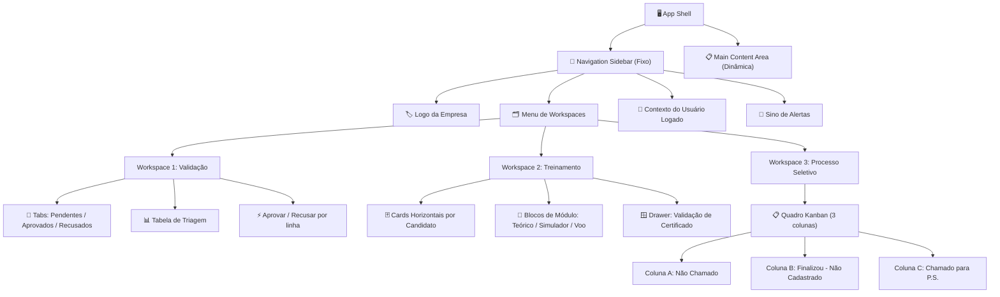

# 🎨 Especificação de Interface e Experiência do Usuário (UI/UX)
### Sistema Escola Recomendada — Workspaces por Fase de Processo | v2.0

> **Escopo:** Redesign arquitetural da interface atual para o modelo de Workspaces com Navigation Sidebar. Cada ambiente exibe apenas as informações e ações relevantes para sua fase específica do processo.

---

## 1. Design System — Tokens de Design

### 1.1 Paleta de Cores Semânticas

| Token | Tailwind | Hex | Uso |
|---|---|---|---|
| `bg-base` | `slate-950` | `#020617` | Fundo geral da aplicação |
| `bg-surface` | `slate-900` | `#0f172a` | Cards, Sidebar, Modals |
| `bg-elevated` | `slate-800` | `#1e293b` | Hover states, inputs |
| `text-primary` | `slate-100` | `#f1f5f9` | Títulos e dados críticos |
| `text-secondary` | `slate-400` | `#94a3b8` | Labels, metadados |
| **PENDENTE** | `amber-500` | `#f59e0b` | Badge: aguardando ação |
| **EM ANDAMENTO** | `sky-500` | `#0ea5e9` | Badge: em progresso |
| **CONCLUÍDO** | `emerald-500` | `#10b981` | Badge: aprovado/completo |
| **RECUSADO** | `red-500` | `#ef4444` | Badge: erro/recusa |
| **NÃO CADASTRADO** | `gray-500` | `#6b7280` | Badge: status neutro |
| **BRAND** | `sky-500 → indigo-600` | gradiente | Elementos de identidade visual |

### 1.2 Tipografia e Espaçamento

- **Fonte Base:** `Inter` (Google Fonts) — modern, legível, corporate
- **Hierarquia:**
  - `text-[10px]` → metadados, timestamps, labels de badge
  - `text-xs (12px)` → texto de corpo, conteúdo de tabela
  - `text-sm (14px)` → subtítulos de cards, labels de formulário
  - `text-base (16px)` → títulos de seção
  - `text-xl (20px)` → título de workspace ativo
- **Border Radius:** `rounded-lg` (8px) inputs · `rounded-xl` (12px) cards · `rounded-2xl` (16px) modals/drawers

---

## 2. Arquitetura da Informação

### 2.1 Mapa de Componentes Visuais



### 2.2 Visibilidade por Perfil de Usuário

| Workspace | Admin (Empresa) | School Admin (Escola) |
|---|---|---|
| **WS1 — Validação** | ✅ Aprovar e Recusar | 🔒 Somente leitura ou oculto |
| **WS2 — Treinamento** | ✅ Visualiza todos · Valida módulos | ✅ Visualiza próprios · Anexa certificados |
| **WS3 — Processo Seletivo** | ✅ Move cards · Altera status | 👁️ Somente leitura dos próprios candidatos |
| **Notificações** | 🔔 Novos candidatos + módulos anexados | 🔔 Resultados de validação + status PS |

---

## 3. Wireframes Espaciais (Textual/ASCII)

### 3.1 Layout Shell Geral

```
┌──────────────────────────────────────────────────────────────────────────┐
│  ┌─────────────────┐  ┌─────────────────────────────────────────────┐   │
│  │  SIDEBAR        │  │  MAIN CONTENT AREA                          │   │
│  │  (256px)        │  │                                             │   │
│  │                 │  │  ┌─────────────────────────────────────┐   │   │
│  │  [★ Logo]       │  │  │  WORKSPACE HEADER                   │   │   │
│  │  Escola         │  │  │  Título Ativo        [🔔 Sino (3)]  │   │   │
│  │  Recomendada    │  │  └─────────────────────────────────────┘   │   │
│  │                 │  │                                             │   │
│  │  ─ ─ ─ ─ ─ ─   │  │  ┌─────────────────────────────────────┐   │   │
│  │                 │  │  │                                     │   │   │
│  │  ● Validação    │  │  │    CONTEÚDO DINÂMICO DO WORKSPACE   │   │   │
│  │  ○ Treinamento  │  │  │                                     │   │   │
│  │  ○ Proc. Selet. │  │  └─────────────────────────────────────┘   │   │
│  │                 │  │                                             │   │
│  │  ─ ─ ─ ─ ─ ─   │  └─────────────────────────────────────────────┘   │
│  │                 │                                                    │
│  │  👤 Admin Geral │                                                    │
│  │  Minha Empresa  │                                                    │
│  └─────────────────┘                                                    │
└──────────────────────────────────────────────────────────────────────────┘
```

### 3.2 Workspace 1 — Validação

```
┌──────────────────────────────────────────────────────────────────────┐
│  Validação de Funcionários                          🔔 [3 não lidas] │
│  Triagem de novos candidatos submetidos pelas Escolas Parceiras       │
│                                                                       │
│  [[ Pendentes (3) ]]   [ Aprovados (45) ]   [ Recusados (2) ]        │
│   ────────────                                                        │
│                                                                       │
│  Nome             RE          ANAC         Escola       Enviado       │
│  ─────────────────────────────────────────────────────────────────── │
│  João Silva       RE-9923     ANAC-12345   Escola Alfa  14/07/26      │
│                                                     [✓ Aprovar]       │
│                                                     [✗ Recusar]       │
│  ─────────────────────────────────────────────────────────────────── │
│  Maria Santos     RE-8812     ANAC-67890   Escola Beta  13/07/26      │
│                                                     [✓ Aprovar]       │
│                                                     [✗ Recusar]       │
└──────────────────────────────────────────────────────────────────────┘
```

### 3.3 Workspace 2 — Treinamento

```
┌──────────────────────────────────────────────────────────────────────────┐
│  Treinamento de Candidatos                               🔔 [1 não lida] │
│  Módulos obrigatórios: Teórico · Simulador · Voo                          │
│                                                                            │
│  [🔍 Buscar candidato...]   [Todos os módulos ▾]                           │
│                                                                            │
│  ┌──────────────────────────────────────────────────────────────────────┐ │
│  │  Roberto Alencar    RE-1092 · ANAC-99281 · Escola Alfa               │ │
│  │                                                                      │ │
│  │  Progresso:  [████████████████████████████████████] 100%             │ │
│  │                                                                      │ │
│  │  ┌───────────────┐  ┌───────────────┐  ┌───────────────┐             │ │
│  │  │ ✅ TEÓRICO    │  │ ✅ SIMULADOR  │  │ ✅ VOO        │             │ │
│  │  │ 05/07 · Alfa  │  │ 10/07 · Alfa  │  │ 13/07 · Alfa  │             │ │
│  │  └───────────────┘  └───────────────┘  └───────────────┘             │ │
│  └──────────────────────────────────────────────────────────────────────┘ │
│                                                                            │
│  ┌──────────────────────────────────────────────────────────────────────┐ │
│  │  Mariana Costa      RE-8823 · ANAC-55102 · Escola Beta               │ │
│  │                                                                      │ │
│  │  Progresso:  [████████────────────────────────────] 33%              │ │
│  │                                                                      │ │
│  │  ┌───────────────┐  ┌───────────────┐  ┌───────────────┐             │ │
│  │  │ ✅ TEÓRICO    │  │ ⏳ SIMULADOR  │  │ ○  VOO        │             │ │
│  │  │ 08/07 · Beta  │  │ [CLIQUE P/REV]│  │ Não iniciado  │             │ │
│  │  └───────────────┘  └───────────────┘  └───────────────┘             │ │
│  └──────────────────────────────────────────────────────────────────────┘ │
└────────────────────────────────────────────────────────────────────────────┘
```

### 3.4 Drawer de Validação de Certificado (Workspace 2)

```
┌─────────────────────────────────────────────────────────────────────────────────┐
│  [Lista de Candidatos — visível esmaecida com overlay bg-black/40]              │
│                                                              ┌────────────────┐  │
│                                                              │ ← [X] Fechar   │  │
│                                                              │                │  │
│                                                              │ 🧩 SIMULADOR   │  │
│                                                              │ Mariana Costa  │  │
│                                                              │                │  │
│                                                              │ ─────────────  │  │
│                                                              │ 📅 10/07/2026  │  │
│                                                              │ 🏫 Escola Beta │  │
│                                                              │ 📄 cert.pdf    │  │
│                                                              │                │  │
│                                                              │ ┌────────────┐ │  │
│                                                              │ │            │ │  │
│                                                              │ │ PDF VIEWER │ │  │
│                                                              │ │            │ │  │
│                                                              │ └────────────┘ │  │
│                                                              │                │  │
│                                                              │ ─────────────  │  │
│                                                              │ [✅ Validar]   │  │
│                                                              │ [❌ Rejeitar]  │  │
│                                                              └────────────────┘  │
└─────────────────────────────────────────────────────────────────────────────────┘
```

### 3.5 Workspace 3 — Processo Seletivo (Kanban)

```
┌─────────────────────────────────────────────────────────────────────────────┐
│  Processo Seletivo                                          🔔 [0]           │
│  Candidatos com 100% de treinamento concluído         Total formados: 12     │
│                                                                              │
│  ┌───────────────────┐  ┌───────────────────┐  ┌───────────────────┐        │
│  │  ● NÃO CHAMADO(4) │  │  🟡 FINALIZOU (2) │  │  🔵 CHAMADO PS(6)│        │
│  │                   │  │  Não Cadastrado   │  │                   │        │
│  │  ┌─────────────┐  │  │  ┌─────────────┐  │  │  ┌─────────────┐  │        │
│  │  │ Carlos Souza│  │  │  │ Ana Paula   │  │  │  │ João Silva  │  │        │
│  │  │ RE-5561     │  │  │  │ RE-1233     │  │  │  │ RE-9923     │  │        │
│  │  │ ANAC-887    │  │  │  │ ANAC-441    │  │  │  │ ANAC-123    │  │        │
│  │  │ Escola Alfa │  │  │  │ Escola Beta │  │  │  │ Escola Alfa │  │        │
│  │  │ Concl:05/07 │  │  │  │ Concl:03/07 │  │  │  │ Concl:01/07 │  │        │
│  │  │             │  │  │  │             │  │  │  │             │  │        │
│  │  │ [▶ Avançar] │  │  │  │ [◀]   [▶]  │  │  │  │ [◀ Voltar]  │  │        │
│  │  └─────────────┘  │  │  └─────────────┘  │  │  └─────────────┘  │        │
│  └───────────────────┘  └───────────────────┘  └───────────────────┘        │
└─────────────────────────────────────────────────────────────────────────────┘
```

---

## 4. Especificação Detalhada de Componentes

### 4.1 Navigation Sidebar

| Elemento | Classe Tailwind | Comportamento |
|---|---|---|
| Container | `w-64 h-screen bg-slate-900 border-r border-slate-800 fixed left-0 flex flex-col` | Fixo à esquerda |
| Logo area | `p-6 border-b border-slate-800` | Gradiente brand |
| Nav item ativo | `border-l-2 border-sky-500 bg-sky-500/5 text-sky-400 font-semibold` | Workspace atual |
| Nav item hover | `hover:bg-slate-800/50 hover:text-slate-200 transition` | Feedback visual |
| Badge contador | `bg-amber-500 text-slate-950 text-[10px] font-bold px-1.5 py-0.5 rounded-full` | Count > 0 |
| User footer | `mt-auto p-4 border-t border-slate-800` | Perfil + sino |

### 4.2 Blocos de Módulo (Workspace 2)

| Estado do Módulo | Aparência | Borda | Ícone |
|---|---|---|---|
| **Não iniciado** | `bg-slate-800/50 text-slate-500` | `border-slate-700` | `Circle` cinza |
| **Cert. Anexado** (aguarda admin) | `bg-amber-500/10 text-amber-400` | `border-amber-500/30` | `Clock` âmbar pulsando |
| **Concluído e Validado** | `bg-emerald-500/10 text-emerald-400` | `border-emerald-500/30` | `CheckCircle` verde |

### 4.3 Barra de Progresso Visual

| Progresso | Cor do Fill | Contexto |
|---|---|---|
| 0% | `bg-slate-700` | Nenhum módulo iniciado |
| 1–66% | `bg-gradient-to-r from-sky-500 to-blue-600` | Em andamento |
| 100% | `bg-gradient-to-r from-emerald-500 to-teal-500` | Todos concluídos |

### 4.4 Colunas Kanban (Workspace 3)

| Coluna | Header Color | Badge |
|---|---|---|
| **Não Chamado** | `bg-slate-800/50 text-slate-300` | `bg-slate-700 text-slate-400` |
| **Finalizou (Não Cadastrado)** | `bg-amber-500/5 text-amber-400` | `bg-amber-500/20 text-amber-400` |
| **Chamado para P.S.** | `bg-sky-500/5 text-sky-400` | `bg-sky-500/20 text-sky-400` |

---

## 5. Guia de Componentes Recomendado

### 5.1 Stack Atual (Instalado)
- **React + Vite + TypeScript** ✅
- **Tailwind CSS** ✅
- **lucide-react** ✅

### 5.2 Componentes a Adicionar (Shadcn/ui)

```bash
npx shadcn@latest init
npx shadcn@latest add tabs           # WS1: Filtro de estado
npx shadcn@latest add drawer         # WS2: Slide-over de certificado
npx shadcn@latest add alert-dialog   # Confirmações críticas (Recusar/Rejeitar)
npx shadcn@latest add progress       # Barra de progresso
npx shadcn@latest add badge          # Status badges
npx shadcn@latest add sonner         # Toast notifications
npx shadcn@latest add tooltip        # Dicas nos botões de módulo
```

### 5.3 Biblioteca Kanban

```bash
# dnd-kit (recomendado — mais leve e moderno)
npm install @dnd-kit/core @dnd-kit/sortable @dnd-kit/utilities
```

### 5.4 Tabela de Mapeamento Completo

| Componente | Biblioteca | Workspace |
|---|---|---|
| Navigation Sidebar | Custom Tailwind | Global |
| Tab Filter | `Tabs` (Shadcn) | WS1 |
| Tabela de triagem | Custom Tailwind | WS1 |
| Card de candidato | Custom Tailwind | WS2 |
| Progress Bar | `Progress` (Shadcn) | WS2 |
| Bloco de módulo | Custom Tailwind | WS2 |
| Drawer de certificado | `Drawer` (Shadcn/Radix) | WS2 |
| PDF Viewer | `<iframe>` ou `react-pdf` | WS2 Drawer |
| Kanban Board | `dnd-kit` | WS3 |
| Alert Dialog | `AlertDialog` (Shadcn) | WS1 + WS2 |
| Toast global | `Sonner` (Shadcn) | Global |
| Notification Dropdown | `Popover` (Shadcn) + Custom | Sidebar |
| Icons | `lucide-react` | Global |

---

## 6. Roteiro de Implementação

O `App.tsx` atual (1.062 linhas) é um componente monolítico. A migração deve ser por fases:

### Fase 1 — Shell e Sidebar (1–2 dias)
- Criar `<AppShell>` com layout Sidebar + Main Area
- Criar `<NavigationSidebar>` com menu e estado ativo
- Extrair lógica em custom hooks (`useCandidates`, `useModules`, `useNotifications`)

### Fase 2 — Workspace 1: Validação (1 dia)
- Criar `<ValidationWorkspace>` com `<TabFilter>` e tabela de triagem
- Botões Aprovar/Recusar já funcionais — apenas reorganizar

### Fase 3 — Workspace 2: Treinamento (2–3 dias)
- Criar `<TrainingWorkspace>` com cards horizontais
- Criar `<ModuleBlock>` com 3 estados visuais
- Implementar `<CertificateDrawer>` com Shadcn Drawer

### Fase 4 — Workspace 3: Processo Seletivo (2 dias)
- Criar `<SelectionWorkspace>` com 3 colunas
- Integrar `dnd-kit` para drag-and-drop
- Criar `<KanbanCard>` e `<KanbanColumn>`

### Fase 5 — Polish (1 dia)
- Substituir `alert()` por Sonner toasts
- Adicionar animações de transição entre workspaces
- Validar responsividade Desktop + Tablet

---

## 7. Checklist de Qualidade UX

- [ ] Ações críticas (Recusar, Rejeitar) com `AlertDialog` de confirmação
- [ ] Badges com contraste WCAG AA (4.5:1 mínimo)
- [ ] Estados vazios com mensagem e CTA (ex: "Nenhum candidato pendente ✨")
- [ ] `Esc` fecha drawer/modal (Radix gerencia automaticamente)
- [ ] Focus trap em modais (Radix built-in)
- [ ] Toasts: auto-dismiss 5s + botão fechar
- [ ] Sidebar item ativo persiste via `localStorage`
- [ ] Skeleton loaders para transições de dados reais
